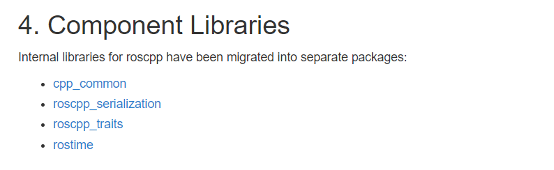
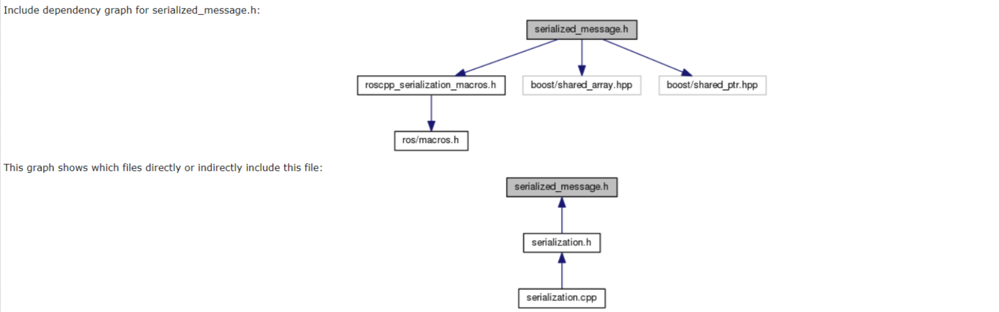
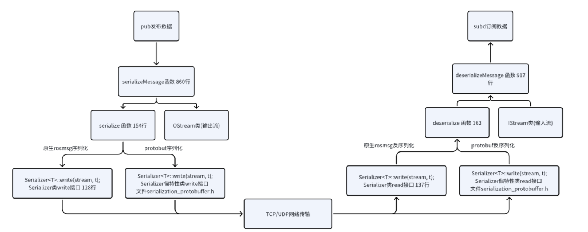

# 描述

基于C++模板编程中的 **SFINAE** 机制，修改 **roscpp** 的核心库 **roscpp_serialization** 和 **roscpp_traits**。

ros同时兼容ROS原生msg和Protobuf消息。


# **依赖库安装**

### ROS

ROS是一个适用于机器人编程的框架，为多节点多任务的程序进程间提供了一个分布式的通信框架

https://wiki.ros.org/noetic/Installation/Ubuntu

### **protobuf**

Protocol Buffers（又名 protobuf）是 Google 的语言中立、平台中立、可扩展的机制，用于序列化结构化数据

https://github.com/protocolbuffers/protobuf/blob/main/cmake/README.md

https://github.com/protocolbuffers/protobuf/releases/download/v3.14.0/protobuf-cpp-3.14.0.tar.gz

### **abseil**

Abseil 是 C++ 代码的开源集合（符合 C++14），旨在增强 C++ 标准库。

https://github.com/abseil/abseil-cpp/blob/master/CMake/README.md

[https://github.com/abseil/abseil-cpp/archive/refs/tags/20230802.0.tar.gz](https://github.com/abseil/abseil-cpp/archive/refs/tags/20200225.2.tar.gz)


# ROS源码分类

## roscpp

官方api简介地址：https://wiki.ros.org/roscpp



## cpp_common

源码地址：https://github.com/ros/ros_comm

官方介绍cpp_common：https://wiki.ros.org/ros_comm

ROS通信相关软件包，包含 ROS 中间件/通信包，核心客户端库（roscpp、rospy、roslisp）和图形自省工具（rostopic、rosnode、rosservice、rosparam），它们为主题、节点、提供实现和工具服务和参数

## roscpp_core

源码地址：https://github.com/ros/roscpp_core/tree/noetic-devel

## roscpp_serialization

官方概述和讲解：https://wiki.ros.org/roscpp/Overview/MessagesSerializationAndAdaptingTypes

功能：

提供序列化和反序列化上层接口 ：将数据结构转换为字节流以便进行网络传输，或者将接收到的字节流转换回原始的数据结构。



## roscpp_traits

消息的元数据：元信息包括消息类型的名称、数据结构、MD5校验和（一种用于检测消息内容是否发生变化的哈希值）以及完整的消息定义。

官方概述：https://wiki.ros.org/roscpp/Overview/MessagesTraits

#### 功能

- 校验数据的元信息是否符合ros的底层接口
- 通过这个接口可以获取消息的元数据
- Pub sub 的时候都会去校验，如果校验失败，会报错，并且数据会发布和订阅失败

消息特征（以及 `message_traits` 命名空间）允许您查询有关消息的某些元数据信息。它们主要用于允许 C++ 类型适应 ROS 消息类型，但也可用于从消息中检索数据类型、md5sum 或完整消息定义等信息。

所有特征必须在命名空间中定义`ros::message_traits`

### Rostime

时间库---ros独有的，自己封装了自己的时间库

类似C++的时间库


# roscpp_serialization分析

## serialized_message.h 

功能: 用于处理ROS消息的序列化和反序列化的存储，作为一个中转站，便于上层接口直接调用

放在一个公用的接口里面，通过这个接口来存储序列化和反序列化的数据

我们用户层，可以直接调用这个公用的接口去获取序列化和反序列化的数据

### SerializedMessage类

```C++
成员变量：
buf: 存储被序列化的消息的字节流
num_bytes: 存储字节流的长度
message_start: 指向消息字节流的起始位置的指针
message: 用于存储反序列化后的消息
type_info: 用于存储消息的类型信息
```


## serialization.h

### Stream类

715

功能：Stream基类，为IStream和OStream提供通用功能

​	 操作和存储序列化之后的数据

成员函数：

1.getData

功能：返回当前stream的指针，这个指针指向当前流的位置，可以通过指针去获取流是内容

2.advance

功能：指定在当前流中前进的长度，有边界异常情况，剩下的部分是还未序列化好的数据

3.getLength

功能：返回stream中剩余空间

### Serializer类 

120

官方解释：由于自 ROS 1.1 起 roscpp 使用基于模板的序列化系统，因此可以调整外部类型以与 ROS 发布/订阅一起使用，而无需修改该类型。这是通过一组专门的特征类以及专门的 Serializer 类来完成的。

Serializer 通用模板类  模板偏特化类，模板全特化

作为一个专门处理序列化和反序列化的类，并且是模板类型的类

成员函数：

1.write

功能：将对象写入流中，对象就是c++定义的各种对象如：string，int, proto对象

2.read

功能：从流中读取对象

3.serializedLength

功能：获取对象序列化长度


## serialize 函数 154

功能：序列化一个对象

```C++
    template <typename T, typename Stream>
    inline void serialize(Stream &stream, const T &t)
    {
      Serializer<T>::write(stream, t);
    }
```

## deserialize 函数 163

功能：反序列化一个对象

```C++
    template <typename T, typename Stream>
    inline void deserialize(Stream &stream, T &t)
    {
      Serializer<T>::read(stream, t);
    }
```

## serializationLength 函数 172

功能：获取对象序列化后长度

```C++
    template <typename T>
    inline uint32_t serializationLength(const T &t)
    {
      return Serializer<T>::serializedLength(t);
    }
```

## serializeMessage 函数 860

功能：序列化信息，生成一个SerializedMessage对象

```C++
    template <typename M>
    inline SerializedMessage serializeMessage(const M &message)
    {
      SerializedMessage m;
      // 获取序列化后消息长度
      uint32_t len = serializationLength(message);
      // 序列化字节流总长度+4，4个字节存储的是len大小
      m.num_bytes = len + 4;
      // 分配一个大小为 m.num_bytes 的内存区域，将指向该内存区域的指针初始化给 m.buf
      m.buf.reset(new uint8_t[m.num_bytes]);

      OStream s(m.buf.get(), (uint32_t)m.num_bytes);
      // 先把 len 序列化到OStream中
      serialize(s, (uint32_t)m.num_bytes - 4);
      // 获取现在真正数据的起始位置
      m.message_start = s.getData();
      // 再把message对象序列化到OStream中
      serialize(s, message);

      return m;
    }
```

## deserializeMessage 函数 917

功能：从SerializedMessage 对象中 反序列化出一个数据类型对象

```C++
    template <typename M>
    inline void deserializeMessage(const SerializedMessage &m, M &message)
    {
      IStream s(m.message_start, m.num_bytes - (m.message_start - m.buf.get()));
      deserialize(s, message);
    }
```


## 序列化过程



# Ros_traits 分析

1. 校验类型：允许在编译时为消息和服务类型添加类型信息，使得在运行时可以对消息类型进行动态的类型检查。
2. 动态反射：可以在运行时获取关于消息的元数据，如protobuf的字段名称、数据类型。

​        可以通过反射机制实现消息的序列化和反序列化，动态地创建、修改和组合消息和服务类型。

1. 消息扩展：消息类型添加截断、压缩、加密等功能。

https://wiki.ros.org/roscpp/Overview/MessagesTraits

message_traits/include/ros/message_event.h

### MessageEvent 类

功能：用于处理消息事件，主要是对message的封装，替换boost::shared_ptr<M const>智能指针

## message_traits/include/ros/message_traits.h

功能：

- 消息特征（和 message_traits 命名空间）允许您查询有关消息的某些信息。
- 它们主要用于允许 C++ 类型适应 ROS 消息类型，但也可用于从消息中检索数据类型、md5sum 或完整消息定义等信息。

## 发布订阅所需特征

### MD5Sum 类

功能：消息MD5校验消息

#### 成员函数

value()

功能：获取MD5 字符串

### DataType 类

功能：消息类型

#### 成员函数

value()  获取消息类型

### Definition 类

功能：获取消息定义描述---元数据

#### 成员函数

value()   获取元数据信息